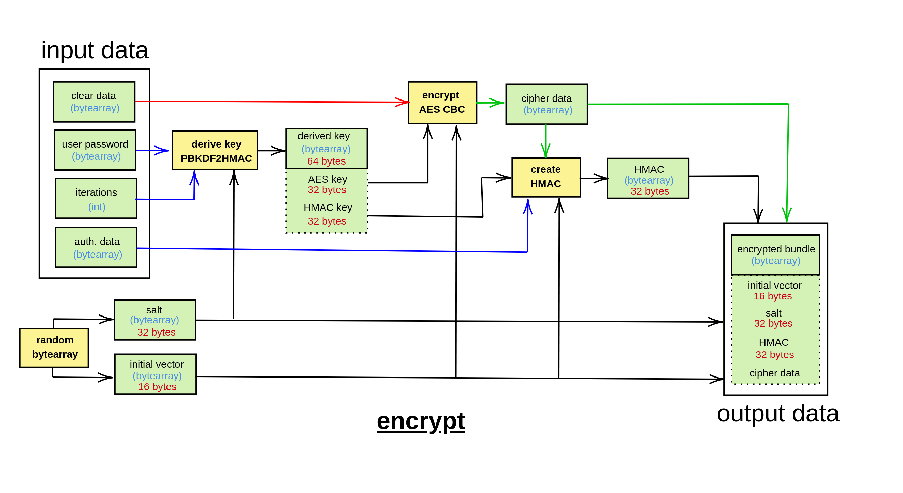
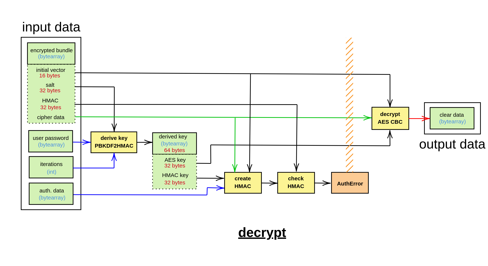

# pyaescbc

## Description

AES-CBC encryption tools based on crytography package !

The package `pyaescbc` provides functions to encrypt and decrypt data using the AES-CBC encryption mode. The package is written in Python and uses the `cryptography` library for the AES encryption and decryption. The package also provides functions to generate a derived key from a password and a pin, and to create an HMAC value from the derived key, IV, and ciphertext. The package is designed to be easy to use and secure, and it is suitable for encrypting sensitive data.

General usage of the package includes:

``` python
import pyaescbc

# Encryption
cleardata = bytearray("Hello, World!", 'utf-8')
pin = bytearray("1234", 'utf-8')
password = bytearray("password", 'utf-8')
iterations = pyaescbc.generate_pin_iterations(pin, delete_keys=True)
authdata = bytearray("user=toto", 'utf-8') # Optional authentication data (can be None)
encrypted_bundle = pyaescbc.encrypt(cleardata, password, iterations, authdata=authdata, delete_keys=True)

# Decryption
pin = bytearray("1234", 'utf-8')
password = bytearray("password", 'utf-8')
iterations = pyaescbc.generate_pin_iterations(pin, delete_keys=True)
authdata = bytearray("user=toto", 'utf-8') # Optional authentication data (can be None)
decrypted_data = pyaescbc.decrypt(encrypted_bundle, password, iterations, authdata=authdata, delete_keys=True)

print(decrypted_data)
```





## Authors

- Artezaru <artezaru.github@proton.me>

- **Git Plateform**: https://github.com/Artezaru/pyaescbc.git
- **Online Documentation**: https://Artezaru.github.io/pyaescbc

## Installation

Install with pip

```
pip install git+https://github.com/Artezaru/pyaescbc.git
```

Clone with git

```
git clone https://github.com/Artezaru/pyaescbc.git
```

## License

See LICENSE
