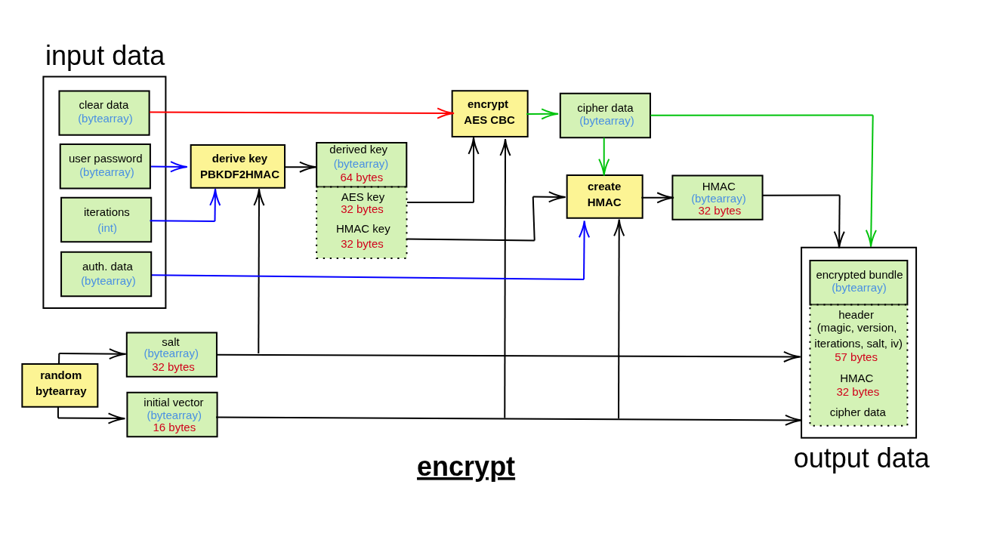
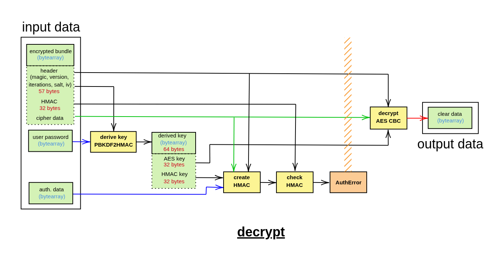

Welcome to pyaescbc's documentation!
=========================================================================================

Description of the package
--------------------------

AES-CBC encryption tools based on crytography package !

The package ``pyaescbc`` provides functions to encrypt and decrypt data using the AES-CBC encryption mode. 
The package is written in Python and uses the ``cryptography`` library for the AES encryption and decryption. 
The package also provides functions to generate to create an HMAC value from the derived key, IV, and ciphertext. 
The package is designed to be easy to use.

The encryption process is designed as follow :

The decryption process is designed as follow :

Security considerations
-----------------------

.. warning::

    **Consider AES-GCM for new projects.**

    ``pyaescbc`` implements AES-256-CBC with HMAC-SHA256 (Encrypt-then-MAC). This construction
    is secure when assembled correctly, but it requires several hand-assembled parts
    (padding, HMAC, key separation, constant-time comparison).
    For new projects, prefer an authenticated encryption mode (AEAD) such as
    `AESGCM <https://cryptography.io/en/latest/hazmat/primitives/aead/#cryptography.hazmat.primitives.ciphers.aead.AESGCM>`_
    or `ChaCha20Poly1305 <https://cryptography.io/en/latest/hazmat/primitives/aead/#cryptography.hazmat.primitives.ciphers.aead.ChaCha20Poly1305>`_
    from the ``cryptography`` library, which provide confidentiality and integrity in a single primitive.

.. note::

    **Memory wiping is best-effort.** Python cannot guarantee that secrets are erased from memory
    (immutable copies may be created by the interpreter or by the underlying libraries).

Contents
--------

The documentation is divided into the following sections:

- **Installation**: This section describes how to install the package.
- **API Reference**: This section contains the documentation of the package's API.
- **Usage**: This section contains the documentation of how to use the package.

.. toctree::
   :maxdepth: 1
   :caption: Contents:

   ./installation
   ./api
   ./usage

Author
------

The package ``pyaescbc`` was created by the following authors:

- Artezaru <artezaru.github@proton.me>

You can access the package and the documentation with the following URL:

- **Git Plateform**: https://github.com/Artezaru/pyaescbc.git
- **Online Documentation**: https://Artezaru.github.io/pyaescbc

License
-------

Please refer to the [LICENSE] file for the license of the package.
